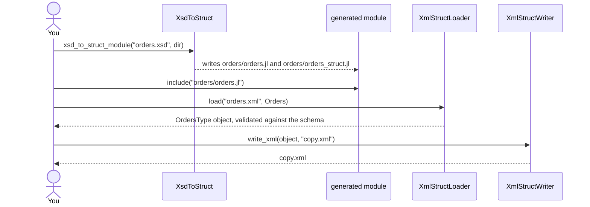

# Getting started

This page goes once through the whole cycle: generate a module from a schema, load a document,
change it, and write it back.

## Installation

XsdToStruct, XmlStructLoader, XmlStructWriter and AbstractXsdTypes are in the General registry.
XmlStructPugixml, which the loader parses documents with, is not, so it is added from the
repository first:

```julia
using Pkg
Pkg.add(url = "https://github.com/Tom-Lemmens/XmlStructTools.jl", subdir = "XmlStructPugixml.jl")
Pkg.add(["XsdToStruct", "XmlStructLoader", "XmlStructWriter"])
```

A generated module needs AbstractXsdTypes and Reexport, and Dates and TimeZones when the schema
has date or time types. They have to be in the environment where the module is used:

```julia
Pkg.add(["AbstractXsdTypes", "Reexport", "Dates", "TimeZones"])
```

The docstring at the top of each generated module lists the packages it needs.

## The workflow



## A schema

The examples in this documentation use a small schema for customer orders. An order has an id, the
time it was placed, either an email address or a phone number, and one or more order lines. A
product code must have the form `ABC-1234`, and a quantity must be at least 1.

```@setup orders
using XsdToStruct, XmlStructLoader, XmlStructWriter
examples = normpath(pkgdir(XsdToStruct), "..", "docs", "examples")
output_dir = mktempdir()
```

```@example orders
print(read(joinpath(examples, "orders.xsd"), String))
```

## Generating the module

[`xsd_to_struct_module`](@ref) reads the schema and writes a module into a directory of the same
name under the output directory. It returns the path of the file to include:

```@example orders
module_file = xsd_to_struct_module(joinpath(examples, "orders.xsd"), output_dir)
basename(module_file)
```

The module takes the name of the schema's target namespace, here `Orders`. It exports one type per
schema type, and re-exports Dates and TimeZones, whose types the fields use:

```@example orders
include(module_file)
using .Orders
schema_types = filter(names(Orders)) do name
    value = getglobal(Orders, name)
    value isa DataType && parentmodule(value) === Orders.Orders_struct
end
```

## Loading a document

```@example orders
print(read(joinpath(examples, "orders.xml"), String))
```

[`load`](@ref) reads the document into the type of the schema's root element:

```@example orders
orders = load(joinpath(examples, "orders.xml"), Orders)
typeof(orders)
```

Elements are fields, repeated elements are vectors, and an element left out is `nothing`:

```@example orders
first_order = orders.order[1]
(first_order.id, first_order.placed, length(first_order.line), first_order.line[1].note)
```

The members of a choice are read like fields; the one that is absent is `nothing`:

```@example orders
(orders.order[1].email, orders.order[2].phone, orders.order[2].email)
```

A date and time becomes a `DateTimeNs`, which keeps the digits below a millisecond. It wraps a
`ZonedDateTime` when the text has a zone offset and a `DateTime` when it does not:

```@example orders
(orders.order[1].placed, orders.order[2].placed)
```

## Changing and writing it back

The generated structs are immutable, so a change builds a new object. The constructors take keyword
arguments named after the elements, and check the schema's restrictions:

```@example orders
extra_line = Line(sku = Sku("CBL-0003"), quantity = Quantity(3), price = 4.5)
changed = Order(
    id = first_order.id,
    placed = first_order.placed,
    email = first_order.email,
    line = [first_order.line; extra_line],
)
updated = OrdersType(order = [changed, orders.order[2]], __xml_attributes = orders.__xml_attributes)
nothing # hide
```

[`write_xml`](@ref) writes the object as a document:

```@example orders
copy_path = joinpath(output_dir, "orders_copy.xml")
write_xml(updated, copy_path)
print(read(copy_path, String))
```

## Next steps

- [Generating modules](guide/generating.md) covers the generator's options and what it writes.
- [Loading XML](guide/loading.md) covers validation and the ways to point the loader at a module.
- [Lazy loading](guide/lazy_loading.md) reads only the parts of a large document that are used.
- [Shipping a schema in a package](guide/packaging.md) makes the first load of a session fast.
