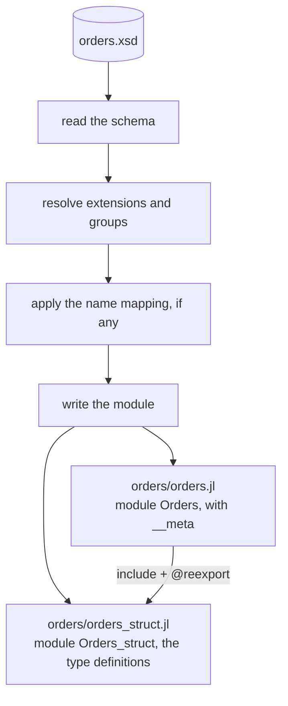

# Generating modules

XsdToStruct turns an XML Schema into Julia source code. The result is a directory holding a module
that defines one type per schema type, with constructors that check the schema's restrictions.



## One schema

```@setup gen
using XsdToStruct
examples = normpath(pkgdir(XsdToStruct), "..", "docs", "examples")
output_dir = mktempdir()
```

[`xsd_to_struct_module`](@ref) takes the schema and an output directory, and returns the path of
the module file:

```@example gen
module_file = xsd_to_struct_module(joinpath(examples, "orders.xsd"), output_dir)
readdir(dirname(module_file))
```

Without an output directory the module is written next to the schema. The directory and the file
are named after the schema file, with characters that are not letters, digits, `_` or `-`
replaced by `_`; the module itself is named after the schema's target namespace.

## What is generated

The main file defines the module and re-exports everything from the file with the type
definitions, so including the main file is all that is needed:

```@example gen
print(read(module_file, String))
```

The `__meta` submodule records what the loader and writer need to know about the schema:

| Name | Meaning |
|:--|:--|
| `root_type` | The type of the root element; [`load`](@ref) builds an object of this type. |
| `root_name` | The name of the root element; [`write_xml`](@ref) names the root element of a document after it. |
| `xsd_filename` | The schema file the module was generated from. |
| `XsdToStruct_version` | The version of XsdToStruct that generated it. |
| `XSDMapping` | The element renames given with `mapping`; see [Renaming elements and types](renaming.md). |

The second file holds the types. Each type's documentation comes from the schema's
`<documentation>` annotation:

```@example gen
print(read(joinpath(dirname(module_file), "orders_struct.jl"), String))
```

A few things to note in this output:

- A simple type with a restriction wraps its value in a struct whose constructor checks it, such
  as `Quantity`, whose `minInclusive` becomes a bound check.
- An element with `minOccurs="0"` becomes a `Union{Nothing, T}` field that defaults to `nothing`.
- An element with `maxOccurs` above 1 becomes a `Vector`.
- A choice is stored in one private field, `__Order_choice_1`, and its members are presented as
  properties of their own, of which at most one may be set. See [Generated types](types.md).
- `xs:decimal` becomes `Float64`, and `xs:dateTime` becomes `Union{DateTimeNs{ZonedDateTime}, DateTimeNs{DateTime}}`.
- Every type has two more fields, `__xml_attributes` and `__validated`, which hold the element's
  XML attributes and whether the object was checked against the schema's restrictions.

## Many schemas

[`generate_modules`](@ref) generates a module per entry of a dictionary. The keys are schema names
and the values are where to find each schema: a file, a directory holding `<name>.xsd`, or a URL to
download it from.

```julia
using XsdToStruct

xsd_locations = Dict(
    "pacs.008.001.09" => joinpath("schemas", "pacs.008.001.09.xsd"),
    "pain.001.001.09" => "schemas",
    "camt.053.001.08" => "https://example.com/xsd/camt.053.001.08.xsd",
)
generate_modules(xsd_locations, joinpath("src", "generated"))
```

This suits a build script that regenerates a package's modules from their schemas.

## Using a generated module

The module is ordinary Julia source. Include it and bring it into scope:

```julia
include(joinpath("generated", "orders", "orders.jl"))
using .Orders          # brings every generated type into scope
# or
import .Orders         # keeps them behind the module name: Orders.Line
```

`using` puts every exported type of the schema into the current namespace, which for a large schema
is hundreds of names. `import` avoids clashes with your own names.

For a module used by more than one session, put it in a package so that it is precompiled; see
[Shipping a schema in a package](packaging.md).
