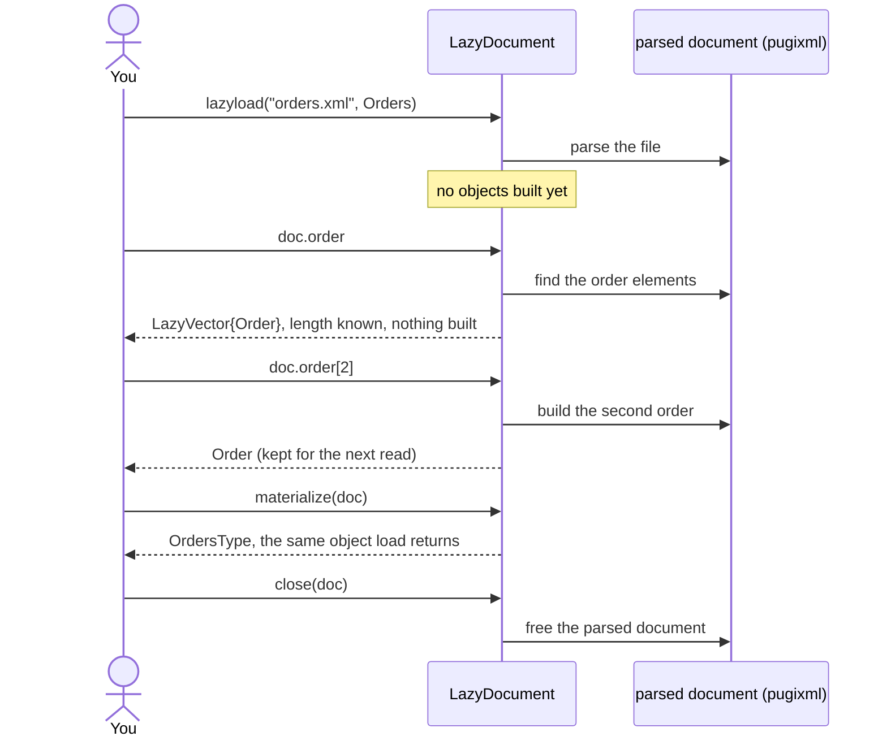

# Lazy loading

[`load`](@ref) builds every object in a document before it returns. For a large document of which
only a few parts are read, [`lazyload`](@ref) opens the document and builds each part when it is
first read.



```@setup lazy
using XsdToStruct, XmlStructLoader
examples = normpath(pkgdir(XsdToStruct), "..", "docs", "examples")
module_file = xsd_to_struct_module(joinpath(examples, "orders.xsd"), mktempdir())
include(module_file)
using .Orders
orders_xml = joinpath(examples, "orders.xml")
```

## Reading parts of a document

```@example lazy
doc = lazyload(orders_xml, Orders)
propertynames(doc)
```

A `LazyDocument` presents the same fields as the root object would. A repeated element becomes a
`LazyVector`, whose length is known without building any element:

```@example lazy
orders = doc.order
(typeof(orders), length(orders))
```

Indexing builds that one element, with validation, and keeps it:

```@example lazy
orders[2].id
```

How each field is presented:

| Field | Read from a `LazyDocument` as |
|:--|:--|
| repeated element | `LazyVector`; each element is built in full when it is first indexed |
| single element of a generated complex type | another `LazyDocument` over that element |
| anything else | its value, built when the field is first read |

## The whole object

[`materialize`](@ref) builds the root object, the same one `load` returns. Code that needs the
generated type itself, such as [`write_xml`](@ref), needs this step:

```@example lazy
full = materialize(doc)
typeof(full)
```

## Closing

The parsed document lives in memory that Julia's garbage collector does not see, so it can stay
alive long after the `LazyDocument` is unused. [`close`](@ref) frees it at once. Values already read
stay valid, because they are Julia objects, not views into the document:

```@example lazy
first_order = doc.order[1]
close(doc)
(isopen(doc), first_order.id)
```

Reading a part that was not read before the document was closed is an error:

```@example lazy
doc = lazyload(orders_xml, Orders)
close(doc)
try
    doc.order
catch err
    err
end
```

To process many documents, pass a function: the document is closed when the function returns, even
when it throws.

```@example lazy
lazyload(doc -> length(doc.order), orders_xml, Orders)
```

## When to use which

| Use | When |
|:--|:--|
| `load` | the whole document is needed, or the document is small |
| `lazyload` | a few fields or records of a large document are read, or records are counted |
| `lazyload` then `materialize` | the document is inspected first and built in full only when needed |

`lazyload` takes the path of a document file. Like `load`, it also accepts the path of the
generated module in place of the module, and `validate = false` to skip the checks.
