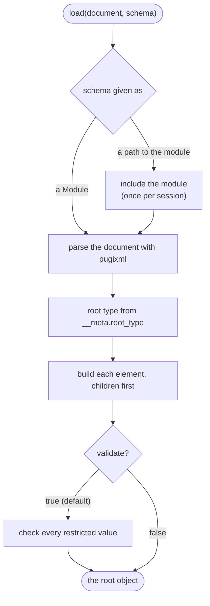

# Loading XML

XmlStructLoader reads an XML document into the types of a generated module. The document is parsed
with pugixml, and the object is built in one pass over it: each element becomes the field of its
parent with the same name, and each value is checked against the schema as it is built.



```@setup load
using XsdToStruct, XmlStructLoader
examples = normpath(pkgdir(XsdToStruct), "..", "docs", "examples")
module_file = xsd_to_struct_module(joinpath(examples, "orders.xsd"), mktempdir())
include(module_file)
using .Orders
orders_xml = joinpath(examples, "orders.xml")
```

## From a module

When the generated module is already loaded, pass it to [`load`](@ref):

```@example load
orders = load(orders_xml, Orders)
[order.id for order in orders.order]
```

The document can also come from any `IO`, such as a string already in memory:

```@example load
xml_text = read(orders_xml, String)
load(IOBuffer(xml_text), Orders).order[2].phone
```

## From a path

`load` also takes the path of the generated module, or of the directory holding it, and includes
the module itself:

```julia
orders = load("orders.xml", joinpath("generated", "orders"))
```

The module is included into XmlStructLoader once per session under its own name. Later calls with
the same module reuse it, and regenerating the module on disk does not replace the one already
loaded; restart the session to load new definitions.

[`import_module_from_xml`](@ref) and [`use_module_from_xml`](@ref) do the inclusion and return the
module, for code that loads several documents or wants the types themselves.
`use_module_from_xml` also re-exports the generated types from XmlStructLoader.

```julia
Orders = import_module_from_xml("orders.xml", joinpath("generated", "orders"))
orders = load("orders.xml", Orders)
```

Including a module inside a running function has a cost: the function cannot see the new types
directly, so the loader calls into them with `Base.invokelatest`. A module that is part of a
package does not have this cost, and is precompiled; see
[Shipping a schema in a package](packaging.md).

## Validation

By default every value with a restriction in the schema is checked while the document is loaded,
and the first violation stops the load. In this document the first order line asks for 0 items,
below the schema's minimum of 1:

```@example load
invalid = replace(xml_text, "<quantity>2</quantity>" => "<quantity>0</quantity>")
try
    load(IOBuffer(invalid), Orders)
catch err
    err
end
```

`validate = false` skips the checks, for documents that are known to be valid or that have to be
read even though they are not:

```@example load
unchecked = load(IOBuffer(invalid), Orders; validate = false)
quantity = unchecked.order[1].line[1].quantity
(quantity.value, quantity.__validated)
```

Each object records in `__validated` whether it was checked.

## What the loaded objects look like

| Schema | Julia |
|:--|:--|
| element of a complex type | field holding a struct of the generated type |
| element with `maxOccurs` above 1 | `Vector` of the element type, in document order |
| element with `minOccurs="0"`, absent | `nothing` |
| choice | properties named after its members; the absent ones are `nothing` |
| attributes of an element | `Dict{String, String}` in the `__xml_attributes` field |
| `xs:string`, `xs:normalizedString`, `xs:token`, `xs:language`, `xs:Name`, `xs:NCName`, `xs:NMTOKEN`, `xs:ID`, `xs:IDREF`, `xs:ENTITY`, `xs:anyURI`, `xs:QName` | `String` |
| `xs:decimal`, `xs:double` | `Float64` |
| `xs:float` | `Float32` |
| `xs:integer`, `xs:int`, `xs:long`, `xs:negativeInteger`, `xs:nonPositiveInteger` | `Int64` |
| `xs:short`, `xs:byte` | `Int16`, `Int8` |
| `xs:nonNegativeInteger`, `xs:positiveInteger`, `xs:unsignedLong` | `UInt64` |
| `xs:unsignedInt`, `xs:unsignedShort`, `xs:unsignedByte` | `UInt32`, `UInt16`, `UInt8` |
| `xs:boolean` | `Bool` |
| `xs:dateTime` | `DateTimeNs{ZonedDateTime}` with a zone offset, `DateTimeNs{DateTime}` without |
| `xs:date`, `xs:time` | `Date`, `Time` |
| `xs:duration` | `Dates.CompoundPeriod`, such as `Day(1) + Hour(2)` for `P1DT2H` |
| `xs:base64Binary` | `Vector{UInt8}`, decoded |
| simple type with a restriction | a struct wrapping the value, checked on construction |

These are all the built-in XML Schema types the generator maps; see [Limitations](../limitations.md)
for the others.

The attributes of the root element, including its namespace declarations, are kept so that writing
the object back produces the same declarations:

```@example load
orders.__xml_attributes
```

## Large documents

`load` builds the whole document. To read parts of a large document, or to count its records
without building them, use [Lazy loading](lazy_loading.md).
