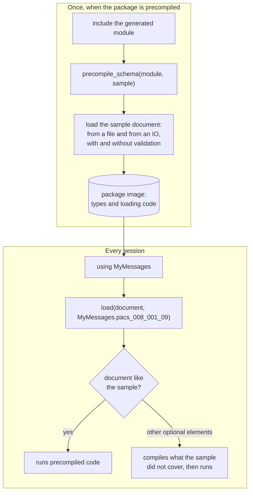

# Shipping a schema in a package

Including a generated module in a session compiles its types and the loader code for them on first
use. For a schema with hundreds of types this takes seconds, every session. Keeping the module in a
package lets Julia precompile it once, and [`XmlStructLoader.precompile_schema`](@ref) also
precompiles loading documents of the schema.



## The package

Generate the module into the package's source directory, include it from the package module, and
call `precompile_schema` with a sample document:

```
MyMessages/
├── Project.toml
├── sample/
│   └── message.xml
└── src/
    ├── MyMessages.jl
    └── pacs_008_001_09/
        ├── pacs_008_001_09.jl
        └── pacs_008_001_09_struct.jl
```

```julia
module MyMessages

import XmlStructLoader

include(joinpath("pacs_008_001_09", "pacs_008_001_09.jl"))

XmlStructLoader.precompile_schema(
    pacs_008_001_09,
    read(joinpath(@__DIR__, "..", "sample", "message.xml"), String),
)

end
```

The package's `Project.toml` lists XmlStructLoader and the packages the generated module needs:
AbstractXsdTypes and Reexport, and Dates and TimeZones when the schema has date or time types.

[`generate_modules`](@ref) in a script that regenerates `src/` from the schemas keeps the module in
step with them.

## Choosing the sample

The loader builds each complex type with code compiled for the set of child elements present in it.
The precompile workload compiles the sets that occur in the sample, so the sample should contain the
optional elements that real documents use. A set that the sample lacks is compiled the first time a
document contains it, which takes some milliseconds per set.

A sample that cannot be loaded produces a warning, not a failed build.

## What it changes

Measured on one machine with the ISO 20022 `pacs.008.001.09` schema (346 types, a 69-element
document) and a schema with one repeated record (a 20,000-record, 5.3 MB document), each loaded in a
fresh Julia process after `using` the package:

| | without `precompile_schema` | with `precompile_schema` |
|:--|--:|--:|
| `pacs.008`, first `load` of the session | 3.2 s | 11 ms |
| `pacs.008`, first `load` of a document with other optional elements | — | 89–95 ms |
| `pacs.008`, later loads (median) | 40 µs | 40 µs |
| 20,000 records, first `load` of the session | 0.82 s | 85–89 ms |
| 20,000 records, later loads (median) | 56 ms | 61–63 ms |

`precompile_schema` moves the cost of the first load to the package's precompilation. It does not
make later loads faster; for the 20,000-record document they measured about 10% slower with it,
for reasons not established.
