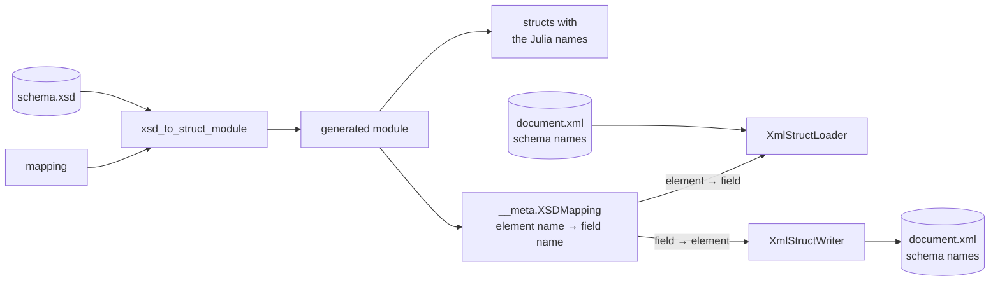

# Renaming elements and types

Element and type names in a schema become field and type names in Julia. A schema can use names
that are not valid Julia identifiers, such as `single-record`, or names that clash with something
in Julia. The `mapping` keyword of the generator gives them other names in Julia, while documents
keep the names the schema defines.



## The mapping

`mapping` takes one of two forms:

- A flat dictionary, `"schema name" => "Julia name"`, renames element names and type names alike.
- A dictionary with the keys `"Fields"` and `"Types"`, each a dictionary of renames, renames
  elements and types separately. Either key may be left out.

```julia
# flat: the same renames for elements and types
mapping = Dict("single-record" => "single_record", "record-type" => "RecordType")

# separate
mapping = Dict(
    "Fields" => Dict("single-record" => "single_record"),
    "Types" => Dict("record-type" => "RecordType"),
)
```

A mapping with `"Fields"` or `"Types"` may hold no other keys. The schema's own name, which names
the generated module, cannot be renamed. Names that are not in the mapping are used as they are.

## An example

This schema uses hyphens in its element names and in the name of a type:

```@setup rename
using XsdToStruct, XmlStructLoader, XmlStructWriter
examples = normpath(pkgdir(XsdToStruct), "..", "docs", "examples")
output_dir = mktempdir()
```

```@example rename
print(read(joinpath(examples, "records.xsd"), String))
```

Generated as it is, the module defines fields such as `single-record`, which Julia cannot parse;
including it fails. With a mapping, every name becomes an identifier:

```@example rename
mapping = Dict(
    "Fields" => Dict(
        "single-record" => "single_record",
        "repeated-record" => "repeated_record",
        "Element-string" => "element_string",
        "Element-double" => "element_double",
    ),
    "Types" => Dict("record-type" => "RecordType"),
)
module_file = xsd_to_struct_module(joinpath(examples, "records.xsd"), output_dir; mapping)
include(module_file)
using .TestRenamedElements
fieldnames(documentType)
```

The element renames are stored in the module:

```@example rename
TestRenamedElements.__meta.XSDMapping
```

## Loading and writing

The loader reads each element into the field it was renamed to:

```@example rename
records = load(joinpath(examples, "records.xml"), TestRenamedElements)
(records.single_record.element_string, [r.element_double for r in records.repeated_record])
```

The writer writes each field under the element name from the schema, so the document comes back
with the schema's names:

```@example rename
copy_path = joinpath(output_dir, "records_copy.xml")
write_xml(records, copy_path)
print(read(copy_path, String))
```

## Where renames apply

| Name in the schema | Renamed by | Notes |
|:--|:--|:--|
| element | `"Fields"` | Also renames the member of a choice. |
| complex or simple type | `"Types"` | The type keeps its submodule and its choice fields consistent with the new name. |
| built-in type such as `double` | — | Always the same Julia type, even when a schema type of the Julia type's name is renamed. |
| schema (module) name | — | Raises an `ArgumentError`. |
| the `value` field of a simple type | — | Always `value`. |

`generate_modules` takes the same `mapping` and applies it to every module it generates.
