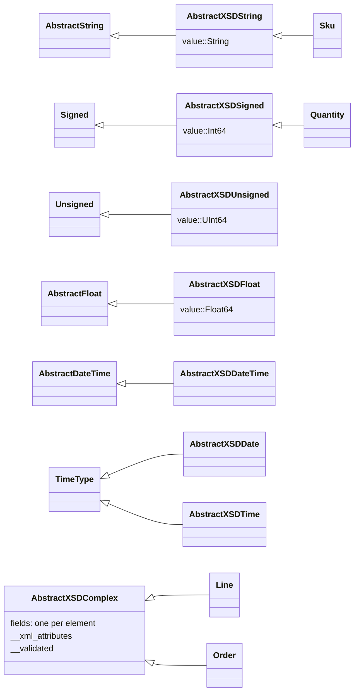

# Generated types

Every type a generated module defines is a subtype of one of the abstract types in
AbstractXsdTypes. Those supertypes carry the behavior the generated code shares: restriction checks,
conversions, and how the types print.



The generated types of the [example schema](../getting_started.md#A-schema) are shown at the
bottom of the diagram.

```@setup types
using XsdToStruct, AbstractXsdTypes
examples = normpath(pkgdir(XsdToStruct), "..", "docs", "examples")
include(xsd_to_struct_module(joinpath(examples, "orders.xsd"), mktempdir()))
using .Orders
```

## Complex types

A complex type is a struct with one field per element, plus:

- `__xml_attributes`, the element's XML attributes as a `Dict{String, String}`, or `nothing`;
- `__validated`, whether the values were checked against the schema's restrictions.

`propertynames` lists the element fields, followed by these two:

```@example types
propertynames(Line(sku = Sku("KBD-0042"), quantity = Quantity(2), price = 49.9))
```

## Simple types

A simple type with a restriction becomes a struct that wraps one `value` and is a subtype of the
matching Julia abstract type, so it can be used where that kind of value is expected:

```@example types
q = Quantity(3)
(q isa Signed, q.value, convert(Int, q) + 1)
```

## Restrictions

The constructor of a restricted simple type checks its value and throws a subtype of
`XSDRestrictionViolationError` when the value is out of range:

```@example types
try
    Quantity(0)
catch err
    err
end
```

Passing `false` as the last argument skips the check, which is what loading with
`validate = false` does:

```@example types
Quantity(0, false).__validated
```

The generator turns these facets into checks:

| Facet | Applies to |
|:--|:--|
| `minInclusive`, `maxInclusive`, `minExclusive`, `maxExclusive` | numbers |
| `totalDigits`, `fractionDigits` | numbers |

The facets that restrict strings (`length`, `minLength`, `maxLength`, `pattern` and `enumeration`)
are not checked: a `Sku` accepts any string, although the schema requires the form `ABC-1234`.

```@example types
Sku("not a sku").value
```

## Choices

The members of a `<choice>` are stored in one private field holding a `NamedTuple`, and presented
as properties of their own. At most one of them can be set; the constructor rejects more:

```@example types
try
    Order(id = "C-1", placed = DateTime(2026), email = "a@example.com", phone = "123", line = Line[])
catch err
    err
end
```

## Dates and times

An `xs:dateTime` field holds a [`DateTimeNs`](@ref): a `DateTime`, or a
`ZonedDateTime` when the value has a zone offset, together with the nanoseconds below its
millisecond. It is a `Dates.AbstractDateTime`, so the usual accessors, arithmetic, comparison and
rounding work on it, and a field takes a plain `DateTime` or `ZonedDateTime` as well:

```@example types
placed = Order(id = "C-1", placed = DateTime(2026, 4, 1), email = "a@example.com", line = Line[]).placed
(placed, placed + Nanosecond(1500), string(placed + Nanosecond(1500)))
```

`DateTime(x)` gives the value without the nanoseconds.

## Defaults

An element with a `default` attribute in the schema gets that value when it is absent. The defaults
of a type are listed by `AbstractXsdTypes.defaults`, as a `NamedTuple` from field name to value, and
are empty for a type without any:

```@example types
AbstractXsdTypes.defaults(Line)
```

## Converting between schemas

Two schemas often describe the same data with types of the same shape. `convert` between two
generated types of the same kind passes the fields across by name:

```julia
convert(OtherSchema.Line, line)
```

The conversion checks only that the target type's fields without defaults are present in the source
and that the source has no fields the target lacks; the field types are not compared, so a mismatch
surfaces as an error from the target's constructor. `AbstractXsdTypes.can_be_converted(T, S)`
reports whether the field names fit.
