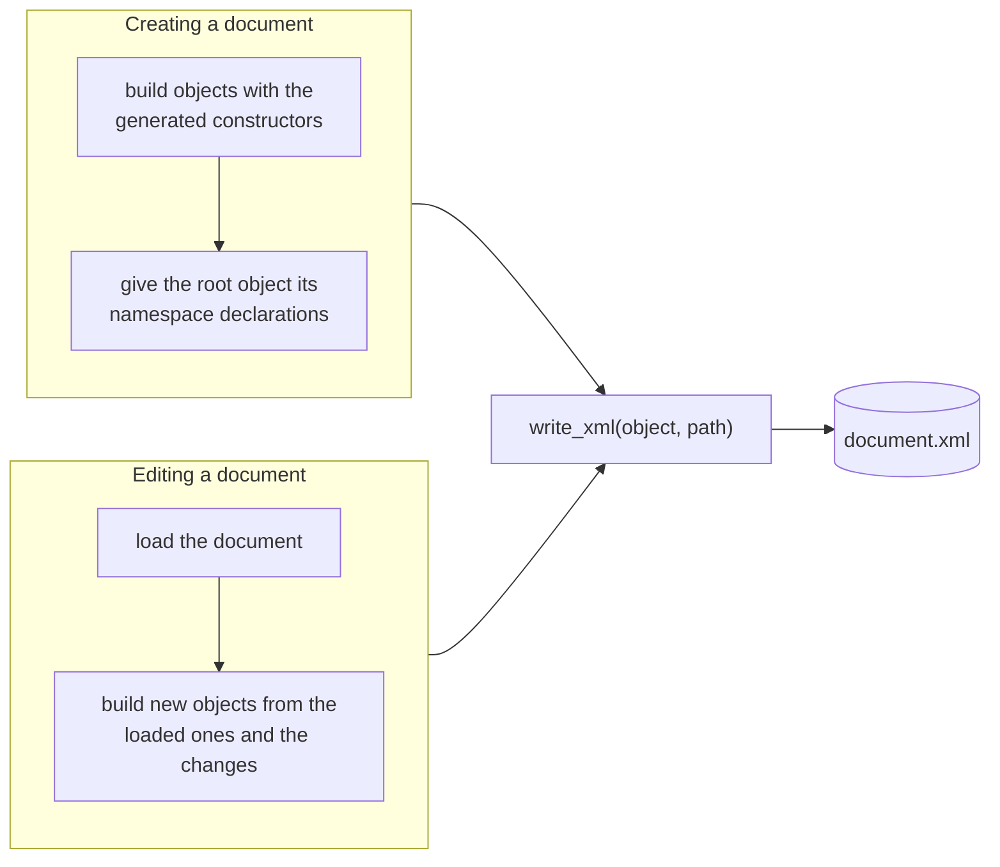

# Writing XML

XmlStructWriter writes an object of a generated type as an XML document. Each field becomes an
element named after the field, or after the element it was renamed from, and the root object's
`__xml_attributes` become the attributes of the root element.



```@setup write
using XsdToStruct, XmlStructLoader, XmlStructWriter
examples = normpath(pkgdir(XsdToStruct), "..", "docs", "examples")
output_dir = mktempdir()
module_file = xsd_to_struct_module(joinpath(examples, "orders.xsd"), output_dir)
include(module_file)
using .Orders
```

## Creating a document

The generated constructors take keyword arguments named after the elements. A simple type with a
restriction is built from its value, and its constructor checks the value:

```@example write
line = Line(sku = Sku("KBD-0042"), quantity = Quantity(2), price = 49.9)
order = Order(id = "B-2001", placed = DateTime(2026, 4, 1, 8, 30), email = "lin@example.com", line = [line])
nothing # hide
```

The root object carries the namespace declarations of the document. The writer needs the
declaration of the schema's namespace, because it gives the root element its prefix:

```@example write
document = OrdersType(
    order = [order],
    __xml_attributes = Dict(
        "xmlns:Orders" => "Orders",
        "xmlns:xsi" => "http://www.w3.org/2001/XMLSchema-instance",
        "xsi:schemaLocation" => "Orders orders.xsd",
    ),
)
path = joinpath(output_dir, "new_order.xml")
write_xml(document, path)
print(read(path, String))
```

The root element is named after the schema's root element, which the generated module records in
`__meta.root_name`. To write it under another name, pass the name before the path:
`write_xml(document, "orders", path)`.

## Editing a document

The generated structs are immutable. To change a document, load it, build new objects from the
loaded ones with the changes applied, and write the result:

```@example write
orders = load(joinpath(examples, "orders.xml"), Orders)
second = orders.order[2]
repriced = Line(sku = second.line[1].sku, quantity = second.line[1].quantity, price = 199.0)
changed = Order(id = second.id, placed = second.placed, phone = second.phone, line = [repriced])
edited = OrdersType(order = [orders.order[1], changed], __xml_attributes = orders.__xml_attributes)
write_xml(edited, joinpath(output_dir, "edited.xml"))
load(joinpath(output_dir, "edited.xml"), Orders).order[2].line[1].price
```

Keeping the loaded root object's `__xml_attributes` keeps the document's namespace declarations and
schema location.

## Values as written

Values are written in the form Julia prints them. A `decimal` is held as a `Float64`, so `49.90`
in a loaded document is written back as `49.9`. A date and time is written with its zone offset
when it wraps a `ZonedDateTime`, and without one when it wraps a `DateTime`, to the nanosecond. A
zero offset is written as `Z`, and the seconds carry no trailing zeros, as in the canonical form of
XML Schema.

## Objects from a lazy document

[`write_xml`](@ref) needs the generated type itself. Build it from a `LazyDocument` with
[`materialize`](@ref) first:

```julia
doc = lazyload("orders.xml", Orders)
write_xml(materialize(doc), "copy.xml")
```
