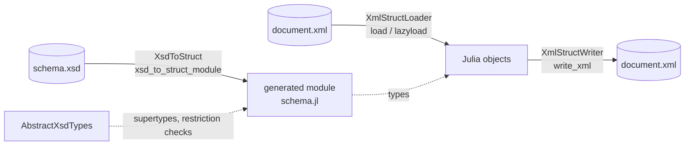

```@raw html
---
layout: home

hero:
  name: XmlStructTools.jl
  text: Schema-based XML data binding for Julia
  tagline: Generate Julia types from an XSD, load XML documents into them, and write them back.
  actions:
    - theme: brand
      text: Getting started
      link: /getting_started
    - theme: alt
      text: Guide
      link: /guide/generating
    - theme: alt
      text: View on GitHub
      link: https://github.com/el-oso/XmlStructTools.jl

features:
  - title: XsdToStruct
    details: Reads an XML Schema and writes a Julia module with one struct per schema type, including the schema's restrictions and defaults.
    link: /guide/generating
  - title: XmlStructLoader
    details: Loads an XML document into the generated structs, validating it against the schema, either all at once or field by field.
    link: /guide/loading
  - title: XmlStructWriter
    details: Writes an instance of the generated structs back to an XML document.
    link: /guide/writing
  - title: AbstractXsdTypes
    details: The abstract types, restriction checks and conversions that every generated module builds on.
    link: /guide/types
---
```

## How the packages fit together



The schema is turned into Julia code once. The generated module is ordinary Julia source: it can be
included in a session, or kept in a package so that it is precompiled with everything else. Loading
and writing then work on any number of documents that follow the schema.

The repository holds five packages:

| Package | Role |
|:--|:--|
| XsdToStruct | Generates a Julia module from an XSD file. |
| XmlStructLoader | Loads XML documents into the generated types. |
| XmlStructWriter | Writes instances of the generated types as XML. |
| AbstractXsdTypes | Supertypes and shared functions used by the generated code. |
| XmlStructPugixml | The XML parser the loader reads documents with, a wrapper around [pugixml](https://pugixml.org). |

For an introduction to the ideas behind the packages, see the talk
[XML Data and Julian Types](https://www.youtube.com/watch?v=Z7qgOBNk-to) from JuliaCon Local
Eindhoven 2023.

::: warning
Only part of the W3C XML Schema recommendation is implemented. See [Limitations](limitations.md)
before relying on a schema feature.
:::
